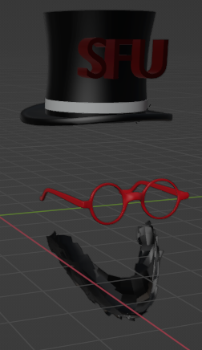
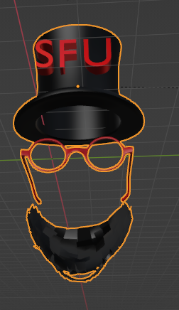
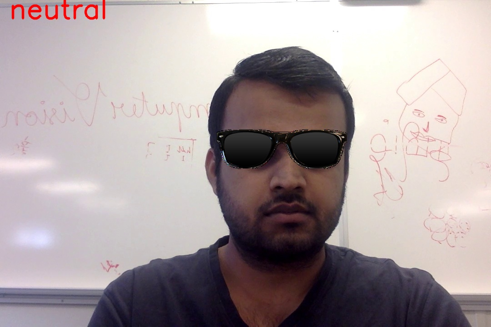
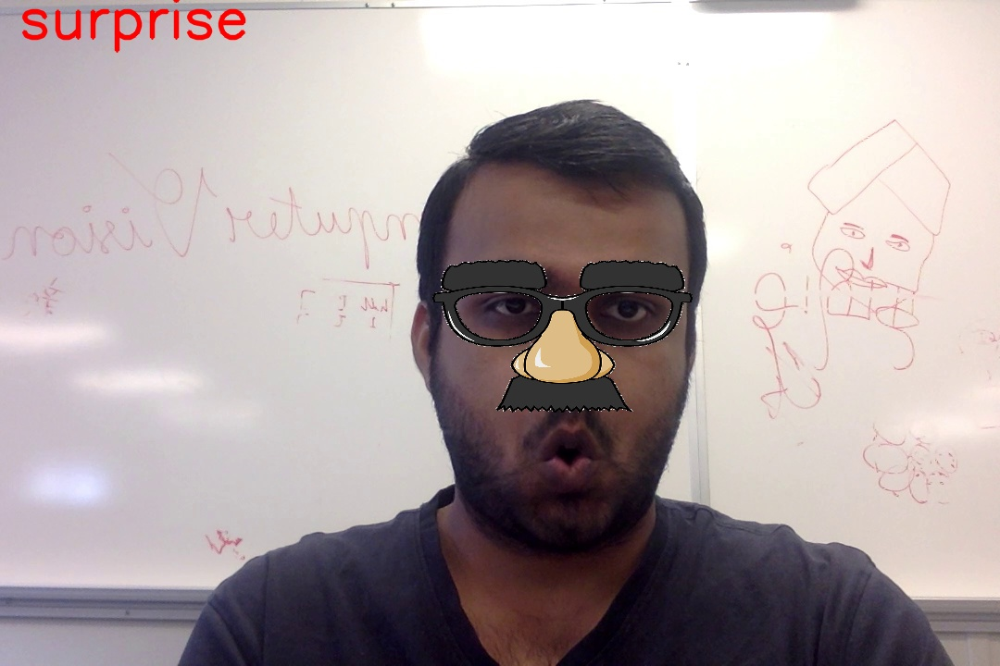

# Emotion-based-AR-filter
Augmented Reality (AR) is a technology that superimposes virtual content in the real
world. The use of 3D filters in video and image editing has become increasingly popular
in recent years, and the demand for real-time applications has grown. In this report, I
will discuss the emotions-based AR filter based on using the PyRender library, which is
a Python library for rendering 3D graphics. The code is written in Python and utilizes
various libraries such as Pyrender, Mediapipe, OpenCV, Trimesh, face alignment and
NumPy.

The project involves the following steps:
* Recognizing Face emotion
* Detecting facial key points in 2D and 3D
* Detect Camera pose from those points
* Load the 3D model and set up scene
* Render 3D model using camera pose with alpha channel
* Overlay the filter over the face based on the emotion

............................................................................The above two image are the 3d filters created using Blender software

The above two image are the output of this project
