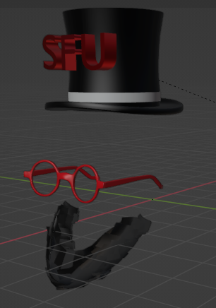
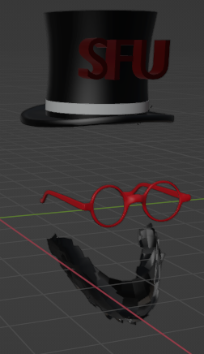

# Emotion-based-AR-filter
Augmented Reality (AR) is a technology that superimposes virtual content in the real
world. The use of 3D filters in video and image editing has become increasingly popular
in recent years, and the demand for real-time applications has grown. In this report, I
will discuss the emotions-based AR filter based on using the PyRender library, which is
a Python library for rendering 3D graphics. The code is written in Python and utilizes
various libraries such as Pyrender, Mediapipe, OpenCV, Trimesh, face alignment and
NumPy.

